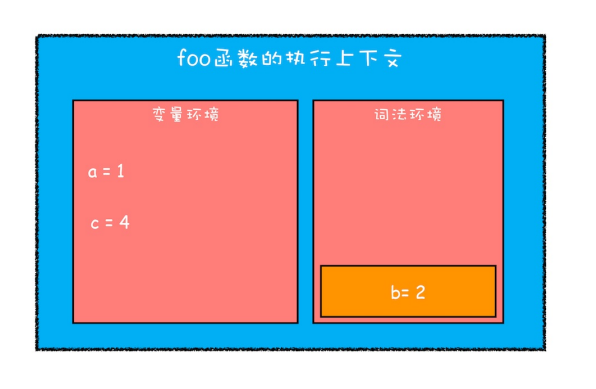
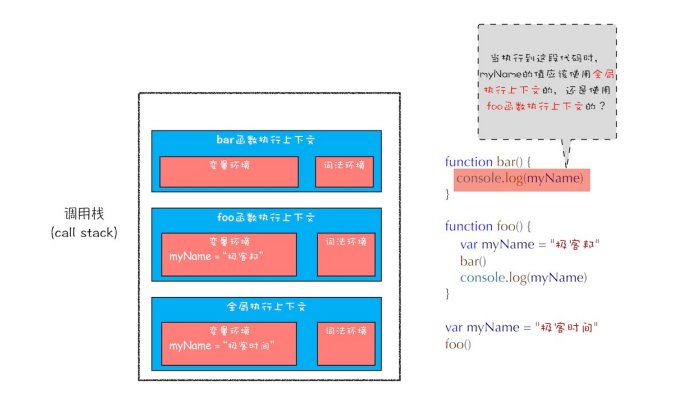

# 变量提升
javascript 代码是按顺序执行的吗？

```
showName()
console.log(myname)
var myname = '小明'
function showName() {
    console.log('函数showName被执⾏');
}

```
如果按顺序执行的逻辑，那输出结果都应该是未定义，执行报错。

实际上上面这段代码的输出结果：

第1⾏输出“函数showName被执⾏”，第2⾏输出“undefined”
 
这是因为javascript 在编译阶段做了变量提升

所谓的变量提升，是指在JavaScript代码执⾏过程中，JavaScript引擎把变量的声明部分和函数的声明部
分提升到代码开头的“⾏为”。变量被提升后，会给变量设置默认值，这个默认值就是我们熟悉的undefined。

```
/*
* 变量提升部分
*/
// 把变量 myname提升到开头，
// 同时给myname赋值为undefined
var myname = undefined
// 把函数showName提升到开头
function showName() {
    console.log('showName被调⽤');
}

/*
* 可执⾏代码部分
*/
showName()
console.log(myname)
// 去掉var声明部分，保留赋值语句
myname = '小明'

```
实际上变量和函数声明在代码⾥的位置是不会改变的，⽽是在编译
阶段被JavaScript引擎放⼊内存中。

⼀段JavaScript代码在执⾏之前需要被JavaScript引擎
编译，编译完成之后，才会进⼊执⾏阶段。


在编译阶段具体又做了什么了，如下图：


从上图可以看出，输⼊⼀段代码，经过编译后，会⽣成两部分内容：执⾏上下⽂（Execution context）和
可执⾏代码。

执⾏上下⽂是JavaScript执⾏⼀段代码时的运⾏环境。

现在我们先看执行上下文中的变量环境对象（Viriable Environment），该对象中
保存了变量提升的内容，⽐如上⾯代码中的变量myname和函数showName，都保存在该对象中。

我们分析一下这个过程：

* 第1⾏和第2⾏，由于这两⾏代码不是声明操作，所以JavaScript引擎不会做任何处理；
* 第3⾏，由于这⾏是经过var声明的，因此JavaScript引擎将在环境对象中创建⼀个名为myname的属性，并使⽤undefined对其初始化；
* 第4⾏，JavaScript引擎发现了⼀个通过function定义的函数，所以它将函数定义存储到堆(HEAP）中，并在环境对象中创建⼀个showName的属性，然后将该属性值指向堆中函数的位置。

JavaScript引擎开始执⾏“可执⾏代码”，按照顺序⼀⾏⼀⾏地执⾏：

* 当执⾏到showName函数时，JavaScript引擎便开始在变量环境对象中查找该函数，由于变量环境对象中存在该函数的引⽤，所以JavaScript引擎便开始执⾏该函数，并输出“函数showName被执⾏”结果。
* 接下来打印“myname”信息，JavaScript引擎继续在变量环境对象中查找该对象，由于变量环境存在myname变量，并且其值为undefined，所以这时候就输出undefined。
* 接下来执⾏第3⾏，把“极客时间”赋给myname变量，赋值后变量环境中的myname属性值改变为“小明”。

代码中出现相同的变量或者函数怎么办？

```
function showName() {
    console.log('小明');
}
showName();
function showName() {
    console.log('小强');
}
showName();
```

分析出来这两次调⽤打印出来的值是什么？

# 调用栈

上面分析了JavaScript引擎编译时，会创建执⾏上下⽂，那哪些情况下会编译并创建执行上下文，有三种情况：

1. 当JavaScript执⾏全局代码的时候，会编译全局代码并创建全局执⾏上下⽂，⽽且在整个⻚⾯的⽣存周期
内，全局执⾏上下⽂只有⼀份。

2. 当调⽤⼀个函数的时候，函数体内的代码会被编译，并创建函数执⾏上下⽂，⼀般情况下，函数执⾏结
束之后，创建的函数执⾏上下⽂会被销毁。

3. 当使⽤eval函数的时候，eval的代码也会被编译，并创建执⾏上下⽂。

现在就来讲讲第二种函数调用时创建的函数执行上下文。

首先先了解JavaScript的调用栈是什么，调⽤栈就是⽤来管理函数调⽤关系的⼀种数据结构。JavaScript引擎利⽤栈的这种数据结构来管理执⾏上下⽂的。在执⾏上下⽂创建好后，JavaScript引擎会将执⾏上下⽂压⼊栈中，通常把这种⽤来管理执⾏上下⽂的栈称为执⾏上下⽂栈，⼜称调⽤栈。

```
// example1

var a = 2
function add(b,c){
    return b+c
}
function addAll(b,c){
    var d = 10
    result = add(b,c)
    return a+result+d
}
addAll(3,6) 

```
下面我们就分析在代码的执⾏过程中，调⽤栈的状态变化情况。

第⼀步，创建全局上下⽂，并将其压⼊栈底。如下图所⽰：


从图中可以看出，变量a、函数add和addAll都保存到了全局上下⽂的变量环境对象中。

全局执⾏上下⽂压⼊到调⽤栈后，JavaScript引擎便开始执⾏全局代码了。⾸先会执⾏a=2的赋值操作，执
⾏该语句会将全局上下⽂变量环境中a的值设置为2。设置后的全局上下⽂的状态如下图所⽰：


第⼆步是调⽤addAll函数。当调⽤该函数时，JavaScript引擎会编译该函数，并为其创建⼀个执⾏
上下⽂，最后还将该函数的执⾏上下⽂压⼊栈中，如下图所⽰：


addAll函数的执⾏上下⽂创建好之后，便进⼊了函数代码的执⾏阶段了，这⾥先执⾏的是d=10的赋值操
作，执⾏语句会将addAll函数执⾏上下⽂中的d由undefined变成了10。

第三步，当执⾏到add函数调⽤语句时，同样会为其创建执⾏上下⽂，并将其压⼊调⽤
栈，如下图所⽰:


当add函数返回时，该函数的执⾏上下⽂就会从栈顶弹出，并将result的值设置为add函数的返回值，也就
是9。如下图所⽰：


紧接着addAll执⾏最后⼀个相加操作后并返回，addAll的执⾏上下⽂也会从栈顶部弹出，此时调⽤栈中就只
剩下全局上下⽂了。最终如下图所⽰：


⾄此，整个JavaScript流程执⾏结束了。调⽤栈是JavaScript引擎追踪函数执⾏的⼀个机制，当⼀次有多个函数被调⽤
时，通过调⽤栈就能够追踪到哪个函数正在被执⾏以及各函数之间的调⽤关系。


### 在开发中，如何利⽤好调⽤栈


1、如何利⽤浏览器查看调⽤栈的信息

当我们执⾏⼀段复杂的代码时，可能很难从代码⽂件中分析其调⽤关系，这时候你可以在想要查看的函数
中加⼊断点，然后当执⾏到该函数时，就可以查看该函数的调⽤栈了。


2、栈溢出（Stack Overflow）

调⽤栈是有⼤⼩的，当⼊栈的执⾏上下⽂超过⼀定数⽬，JavaScript引擎就会报错，我们把这种错误叫
做栈溢出。特别是在写递归代码的时候。

```
function runStack (n) {
    if (n === 0) return 100;
    return runStack( n- 2);
}
runStack(50000);
```
优化下这段代码，以解决栈溢出的问题?

# 块级作用域

### 作⽤域

作⽤域是指在程序中定义变量的区域，该位置决定了变量的⽣命周期。通俗地理解，作⽤域就是变量与函数
的可访问范围，即作⽤域控制着变量和函数的可⻅性和⽣命周期。

在ES6之前，ES的作⽤域只有两种：全局作⽤域和函数作⽤域。

* 全局作⽤域中的对象在代码中的任何地⽅都能访问，其⽣命周期伴随着⻚⾯的⽣命周期。
* 函数作⽤域就是在函数内部定义的变量或者函数，并且定义的变量或者函数只能在函数内部被访问。函数
执⾏结束之后，函数内部定义的变量会被销毁。

### 变量提升所带来的问题

1、变量容易在不被察觉的情况下被覆盖掉

```
var myname = "小明"
function showName(){
    console.log(myname);
    if(0){
        var myname = "小强";
    }
    console.log(myname);
}
showName()
```

2、本应销毁的变量没有被销毁

```
function foo(){
    for (var i = 0; i < 7; i++) {
    }
    console.log(i);
}
foo()
```
如果使⽤C语⾔或者其他的⼤部分语⾔实现类似代码，在for循环结束之后，i就已经被销毁了,但是在JavaScript代码中，i的值并未被销毁，所以最后打印出来的是7。

这同样也是由变量提升⽽导致的，在创建执⾏上下⽂阶段，变量i就已经被提升了，所以当for循环结束之
后，变量i并没有被销毁。

### ES6是如何解决变量提升带来的缺陷

上⾯介绍了变量提升⽽带来的⼀系列问题，为了解决这些问题，ES6引⼊了let和const关键字，从⽽使
JavaScript也能像其他语⾔⼀样拥有了块级作⽤域。

块级作⽤域就是使⽤⼀对⼤括号包裹的⼀段代码，⽐如函数、判断语句、循环语句，甚⾄单独的⼀个{}都可以被看作是
⼀个块级作⽤域。
```
function varTest() {
    var x = 1;
    let y = 1;
    if (true) {
        var x = 2; // 同样的变量!
        let y = 2;
        console.log(x); // 2
        console.log(y); // 2
    }
    console.log(x); // 2
    console.log(y); // 1
}

```
### JavaScript是如何⽀持块级作⽤域的
先看看下面这段代码

```
// example2

function foo(){
    var a = 1
    let b = 2
    {
        let b = 3
        var c = 4
        let d = 5
        console.log(a)
        console.log(b)
    }
    console.log(b)
    console.log(c)
    console.log(d)
}
foo()
```
当执⾏上⾯这段代码的时候，JavaScript引擎会先对其进⾏编译并创建执⾏上下⽂，然后再按照顺序执⾏代码,现在引⼊了let关键字，let关键字会创建块级作⽤域，那么let关键字是如何影响执⾏上下⽂的呢？

第⼀步是编译并创建执⾏上下⽂：


通过上图，我们可以得出以下结论：

* 函数内部通过var声明的变量，在编译阶段全都被存放到变量环境⾥⾯了。
* 通过let声明的变量，在编译阶段会被存放到词法环境（Lexical Environment）中。

第⼆步继续执⾏代码，当执⾏到代码块⾥⾯时，变量环境中a的值已经被设置成了1，词法环境中b
的值已经被设置成了2，这时候函数的执⾏上下⽂就如下图所⽰：


从图中可以看出，当进⼊函数的作⽤域块时，作⽤域块中通过let声明的变量，会被存放在词法环境的⼀个
单独的区域中，这个区域中的变量并不影响作⽤域块外⾯的变量，⽐如在作⽤域外⾯声明了变量b，在该作
⽤域块内部也声明了变量b，当执⾏到作⽤域内部时，它们都是独⽴的存在。

在词法环境内部，维护了⼀个⼩型栈结构，栈底是函数最外层的变量，进⼊⼀个作⽤域块后，就会把
该作⽤域块内部的变量压到栈顶；当作⽤域执⾏完成之后，该作⽤域的信息就会从栈顶弹出，这就是词法环
境的结构。需要注意下，这⾥所讲的变量是指通过let或者const声明的变量。

再接下来，当执⾏到作⽤域块中的console.log(a)这⾏代码时，就需要在词法环境和变量环境中查找变
量a的值了，具体查找⽅式是：沿着词法环境的栈顶向下查询，如果在词法环境中的某个块中查找到了，就
直接返回给JavaScript引擎，如果没有查找到，那么继续在变量环境中查找。

这样⼀个变量查找过程就完成了


当作⽤域块执⾏结束之后，其内部定义的变量就会从词法环境的栈顶弹出，最终执⾏上下⽂如下图所⽰：



块级作⽤域就是通过词法环境的栈结构来实现的，⽽变量提升是通过变量环境来实现，通过这两者的结合，JavaScript引擎也就同时⽀持了变量提升和块级作⽤域了。

思考：

```
// example3

let myname= '小明'

{
    console.log(myname)
    let myname= '小强'
}

```

# 作用域链和闭包

什么是作用域，先看看下面这段代码：

```
function bar() {
    console.log(myName)
}
function foo() {
    var myName = "极客邦"
    bar()
}
var myName = "极客时间"
foo()

```

最后打印的结果是什么呢？



### 作用域链

其实在每个执⾏上下⽂的变量环境中，都包含了⼀个外部引⽤，⽤来指向外部的执⾏上下⽂，我们把这个外部引⽤称为outer。

当⼀段代码使⽤了⼀个变量时，JavaScript引擎⾸先会在“当前的执⾏上下⽂”中查找该变量，⽐如上⾯那段代码在查找myName变量时，如果在当前的变量环境中没有查找到，那么JavaScript引擎会继续在outer所指向的执⾏上下⽂中查找。如下图：


从图中可以看出，bar函数和foo函数的outer都是指向全局上下⽂的，这也就意味着如果在bar函数或者foo函数中使⽤了外部变量，那么JavaScript引擎会去全局执⾏上下⽂中查找。我们把这个查找的链条就称为作⽤域链。

那为什么是foo函数调⽤的bar函数，但bar函数的外部引⽤是全局执⾏上下⽂，⽽不是foo函数的执⾏上下⽂？

这是因为在JavaScript执⾏过程中，其作⽤域链是由词法作⽤域决定的。

词法作⽤域就是指作⽤域是由代码中函数声明的位置来决定的，所以词法作⽤域是静态的作⽤域，通过它就能够预测代码在执⾏过程中如何查找标识符。

如下图：


从图中可以看出，词法作⽤域就是根据代码的位置来决定的，其中main函数包含了bar函数，bar函数中包含了foo函数，因为JavaScript作⽤域链是由词法作⽤域决定的，所以整个词法作⽤域链的顺序是：foo函数作⽤域—>bar函数作⽤域—>main函数作⽤域—>全局作⽤域。

也就是说，词法作⽤域是代码阶段就决定好的，和函数是怎么调⽤的没有关系。

### 级作⽤域中的变量查找

前⾯我们通过全局作⽤域和函数级作⽤域来分析了作⽤域链，那接下来我们再来看看块级作⽤域中变量是如何查找的？

分析下面这段代码的执行结果：

```
// example4

function bar() {
    var myName = "极客世界"
    let test1 = 100
    if (1) {
        let myName = "Chrome浏览器"
        console.log(test)
    }
}

function foo() {
    var myName = "极客邦"
    let test = 2
    {
        let test = 3
        bar()
    }
}

var myName = "极客时间"
let myAge = 10
let test = 1
foo()

```

ES6是⽀持块级作⽤域的，当执⾏到代码块时，如果代码块中有let或者const声明的变量，那么变量就会存放到该函数的词法环境中。对于上⾯这段代码，当执⾏到bar函数内部的
if语句块时，其调⽤栈的情况如下图所⽰：


上图的序号1、2、3、4、5就是其查找过程。

### 闭包

理解了变量环境、词法环境和作⽤域链等概念，接下来再看看什么是JavaScript中的闭包：

```
// example5

function foo() {
    var myName = "极客时间"
    let test1 = 1
    const test2 = 2
    var innerBar = {
        getName:function(){
            console.log(test1)
            return myName
        },
    setName:function(newName){
            myName = newName
        }
    }
    return innerBar
}
var bar = foo()
bar.setName("极客邦")
bar.getName()
console.log(bar.getName())

```

当执⾏到foo函数内部的return innerBar这⾏代码时调⽤栈的情况:


从上⾯的代码可以看出，innerBar是⼀个对象，包含了getName和setName的两个⽅法（通常我们把对象
内部的函数称为⽅法）。可以看到，这两个⽅法都是在foo函数内部定义的，并且这两个⽅法内部都使⽤
了myName和test1两个变量。

根据词法作⽤域的规则，内部函数getName和setName是可以访问它们的外部函数foo中的变量，所以
当innerBar对象返回给全局变量bar时，虽然foo函数已经执⾏结束，但是getName和setName函数依然可
以使⽤foo函数中的变量myName和test1。所以当foo函数执⾏完成之后，其整个调⽤栈的状态如下图所
⽰：


从上图可以看出，foo函数执⾏完成之后，其执⾏上下⽂从栈顶弹出了，但是由于返回的setName和getName⽅法中使⽤了foo函数内部的变量myName和test1，所以这两个变量依然保存在内存中。这像极了setName和getName⽅法背的⼀个专属背包，⽆论在哪⾥调⽤了setName和getName⽅法，它们都会背着这个foo函数的专属背包。之所以是专属背包，是因为除了setName和getName函数之外，其他任何地⽅都是⽆法访问该背包的，我们就可以把这个背包称为foo函数的闭包。

所以在JavaScript中，根据词法作⽤域的规则，内部函数总是可以访问其外部函数中声明的变量，当通过调⽤⼀个外部函数返回⼀个内部函数后，即使该外部函数已经执⾏结束了，但是内部函数引⽤外部函数的变量依然保存在内存中，我们就把这些变量的集合称为闭包。
⽐如外部函数是foo，那么这些变量的集合就称为foo函数的闭包。


那这些闭包是如何使⽤的呢？当执⾏到bar.setName⽅法中的myName = "极客邦"这句代码时，JavaScript引擎会沿着“当前执⾏上下⽂‒>foo函数闭包‒>全局执⾏上下⽂”的顺序来查找myName变量，如图：


也可以通过“开发者⼯具”来看看闭包的情况:


### 闭包是怎么回收的

通常，如果引⽤闭包的函数是⼀个全局变量，那么闭包会⼀直存在直到⻚⾯关闭；但如果这个闭包以后不再使⽤的话，
就会造成内存泄漏。

如果引⽤闭包的函数是个局部变量，等函数销毁后，在下次JavaScript引擎执⾏垃圾回收时，判断闭包这块
内容如果已经不再被使⽤了，那么JavaScript引擎的垃圾回收器就会回收这块内存。

所以在使⽤闭包的时候，你要尽量注意⼀个原则：如果该闭包会⼀直使⽤，那么它可以作为全局变量⽽存
在；但如果使⽤频率不⾼，⽽且占⽤内存⼜⽐较⼤的话，那就尽量让它成为⼀个局部变量。

思考下面这段代码会产生闭包嘛：

```
// example6

var bar = {
    myName:"小明",
    printName: function () {
        console.log(myName)
    }
}
function foo() {
    let myName = "小强"
    return bar.printName
}
let myName = "小王"
let _printName = foo()
_printName()
bar.printName()

```

# this

JavaScript中的this是什么?

执行上下文中包含了变量环境、词法环境、外部环境和this。this 是和执行上下文绑定的，也就是说每个执行上下文中都有一个this。


执行上下文主要分三种：全局执行上下文中的this、函数中的this和eval中的this。

全局执⾏上下⽂中的this

在控制台中输⼊console.log(this)来打印出来全局执⾏上下⽂中的this，最终输出的是window
对象。所以全局执⾏上下⽂中的this是指向window对象的。

函数执⾏上下⽂中的this

```
function foo(){
    console.log(this)
}
foo()

```
执⾏这段代码，打印出来的也是window对象，这说明在默认情况下调⽤⼀个函数，其执⾏上下⽂中的this也是指向window对象的。

通常情况下，有下⾯三种⽅式来设置函数执⾏上下⽂中的this值。

1、通过函数的call⽅法设置

```
// example7

let bar = {
    myName : "小强",
    test1 : 1
}
function foo(){
    this.myName = "小明"
}

foo.call(bar)
console.log(bar)
console.log(myName)

```
其实除了call⽅法，你还可以使⽤bind和apply⽅法来设置函数执⾏上下⽂中的this。

2、通过对象调⽤⽅法设置

要改变函数执⾏上下⽂中的this指向，除了通过函数的call⽅法来实现外，还可以通过对象调⽤的⽅式，比如：

```
var myObj = {
    name : "小明",
    showThis: function(){
        console.log(this)
    }
}
myObj.showThis()

```

使⽤对象来调⽤其内部的⼀个⽅法，该⽅法的this是指向对象本⾝的。

接下来改变下调⽤⽅式，把showThis赋给⼀个全局对象，然后再调⽤该对象：

```
var myObj = {
    name : "小明",
    showThis: function(){
        this.name = "小强"
        console.log(this)
    }
}
var foo = myObj.showThis
foo()

```
执⾏这段代码，你会发现this⼜指向了全局window对象。

3、通过构造函数中设置

```
// example8

function CreateObj(){
    this.name = "xiaoming";
    console.log(this);
}
var myObj = new CreateObj()
console.log(myObj.name);
```
在这段代码中，我们使⽤new创建了对象myObj，此时的构造函数CreateObj中的this就是新对象本身。

